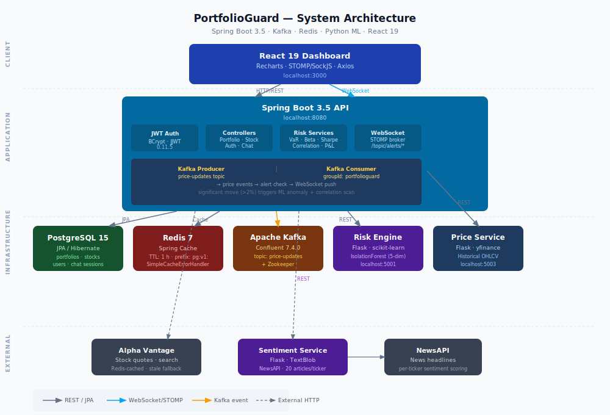
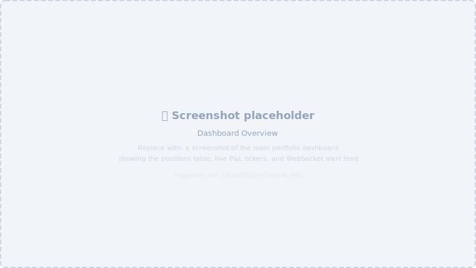
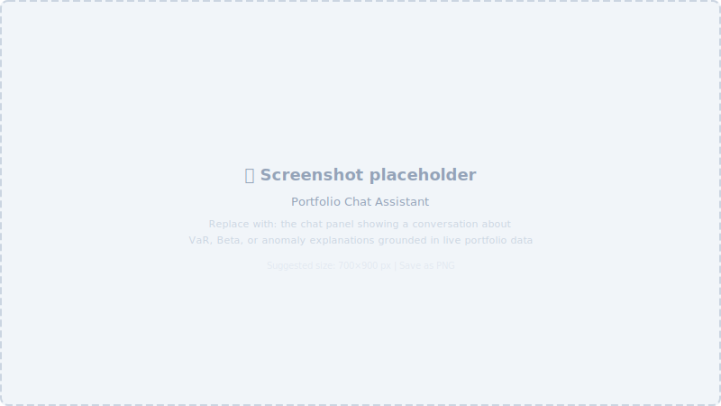

<div align="center">

# PortfolioGuard

**An institutional portfolio risk monitoring platform inspired by the architecture of systems like BlackRock Aladdin.**

Real-time risk metrics, ML-based anomaly detection, event-driven alerts, and a rule-based portfolio chat assistant — built on Spring Boot, Kafka, Redis, and Python microservices.

[](https://github.com/Shivaan2007/portfolioguard/actions/workflows/ci.yml)
[](https://openjdk.org/projects/jdk/17/)
[](https://spring.io/projects/spring-boot)
[](https://react.dev)
[](https://github.com/Shivaan2007/portfolioguard/actions/workflows/ci.yml)
[](LICENSE)
[](docker-compose.yml)

</div>

---

## Overview

PortfolioGuard is a full-stack portfolio risk management system. It computes financial risk metrics on stock portfolios in real time, feeds price-update events through an Apache Kafka pipeline, and pushes anomaly and correlation-breakdown alerts to the browser via WebSocket. A Python microservice runs Scikit-learn's Isolation Forest against five concurrent risk dimensions, and a second service scores news sentiment with TextBlob per ticker.

The project is a self-contained reference implementation. It is not affiliated with BlackRock. It demonstrates how distributed systems patterns used in institutional finance — decoupled event pipelines, ML anomaly scoring, stateless JWT authentication, and multi-tier caching — translate into a coherent engineering stack.

---

## Problem Statement

Personal brokerage dashboards show price charts. They do not expose the underlying risk structure of a portfolio: how volatile it is relative to the market, how likely it is to exceed a loss threshold on a bad day, whether two positions that appeared uncorrelated last quarter have begun moving together, or whether the current regime looks statistically anomalous compared to recent history.

PortfolioGuard makes those calculations accessible through a REST API and a browser dashboard, without requiring a Bloomberg Terminal or a quant team to interpret the output.

---

## System Architecture

<div align="center">
  
</div>

### Data flow summary

1. **Price refresh** — `POST /api/portfolios/{id}/refresh-prices` calls `PortfolioService.refreshAndPublishPrices`, which fetches current prices via `MarketDataService` and publishes a `PriceUpdateEvent` to the Kafka `price-updates` topic for each position.
2. **Kafka consumer** — `PriceEventConsumer` listens on the `price-updates` topic. Every event broadcasts a `PRICE_UPDATE` WebSocket alert. Moves above ±2% additionally invoke the risk alert pipeline.
3. **Risk alert pipeline** — `RiskAlertService` calls the Python risk engine for Isolation Forest scoring and `CorrelationMonitorService` for pairwise correlation breakdown detection. Both results are broadcast as `ML_ANOMALY` or `CORRELATION_BREAKDOWN` WebSocket events on `/topic/alerts/{portfolioId}`.
4. **Live dashboard ticks** — a separate `LivePriceScheduler` broadcasts simulated price ticks over WebSocket every 5 seconds, providing smooth dashboard animation independently of the rate-limited Alpha Vantage API. The scheduler applies 0.1–0.3% per-tick noise, clamped between −20% and +50% of each position's purchase price.
5. **Caching** — `StockSearchService` uses manual `CacheManager` operations so stale data can be served on Alpha Vantage rate-limit responses. `SentimentService` uses `@Cacheable` with a `unless` guard that skips caching error responses. Cache keys are prefixed `pg:v1:` and have a 1-hour TTL. Redis errors are non-fatal via `SimpleCacheErrorHandler`.

---

## Features

### Portfolio Management

- Create named portfolios with an optional description and strategy label.
- Add and remove stock positions (ticker, quantity, purchase price, sector).
- Every write operation is scoped to the authenticated user — no cross-user data access is possible.
- Portfolio IDs are UUID-generated server-side.

### Financial Risk Metrics

Computed on demand at `GET /api/portfolios/{id}/risk` and `/analytics`:

| Metric | Method | Data source |
|---|---|---|
| Daily P&L | `(currentPrice − purchasePrice) × quantity` summed | WebSocket tick / price refresh |
| Total Return | `(currentValue − costBasis) / costBasis × 100` | Same |
| Sharpe Ratio | Annualised `(Rp − Rf) / σ` where Rf = 5% / 252 | Historical daily returns via price-service |
| Value at Risk 95% / 99% | Historical simulation — sorted return distribution at 5th / 1st percentile | Historical daily returns via price-service |
| Portfolio Beta | `Cov(Rp, Rm) / Var(Rm)` against SPY | Historical daily returns via price-service |
| Pairwise Correlation | Pearson correlation of daily return series | Historical daily returns via price-service |

The correlation **matrix** returned in `/risk` uses seeded random values for visualisation purposes (noted inline in `RiskMetricsService`). Pairwise correlation used for **breakdown detection** (`/correlations/alerts`) is calculated from actual historical return series.

### ML Anomaly Detection

A Python risk engine (port 5001) runs Scikit-learn `IsolationForest` with `n_estimators=100`, `contamination=0.1`, and a fixed `random_state=42`. The Spring Boot backend assembles a 30-day metrics history per portfolio and POSTs it:

```
Feature vector (per day):  [daily_return, sharpe, beta, var95, avg_correlation]
```

The engine returns a per-point anomaly flag, score, and a boolean `is_current_anomalous` for the most recent data point. When flagged, a `ML_ANOMALY` WebSocket event is broadcast to `/topic/alerts/{portfolioId}`.

A minimum of 10 data points is required before the model will score.

### Correlation Breakdown Detection

`CorrelationMonitorService` computes Pearson correlation for each stock pair in the portfolio over two windows:

- **Baseline** — trailing 90 trading days
- **Current** — trailing 30 trading days

A deviation exceeding 0.3 generates a `CORRELATION_BREAKDOWN` alert. Deviation above 0.5 is classified `HIGH`; 0.3–0.5 is `MEDIUM`.

### News Sentiment Analysis

A Python sentiment service (port 5002) fetches up to 20 recent news headlines per ticker from NewsAPI and scores them with TextBlob polarity:

- Score > 0.1 → `POSITIVE`
- Score < −0.1 → `NEGATIVE`
- Otherwise → `NEUTRAL`

Results include the article count, the raw polarity score, and up to 5 headline strings. Responses are Redis-cached (1-hour TTL, skipping error responses).

### Real-Time WebSocket Alerts

All alert events are pushed over STOMP/SockJS to the React dashboard without polling. Three event types are produced:

| Type | Trigger |
|---|---|
| `PRICE_UPDATE` | Every Kafka price event consumed |
| `ML_ANOMALY` | Isolation Forest flags the current data point |
| `CORRELATION_BREAKDOWN` | Pairwise correlation deviation exceeds 0.3 |

WebSocket endpoint: `/ws` (SockJS). Alert topic pattern: `/topic/alerts/{portfolioId}`.

### Portfolio Chat Assistant

A rule-based NLP assistant bound to the authenticated user's portfolio data. It parses intent from free-text messages using keyword and regex matching — it is not LLM-backed. Supported intents:

- Portfolio risk summary with live P&L and Sharpe ratio
- VaR explanation with the current calculated value
- Beta explanation with the current calculated value
- Sharpe ratio explanation with the current value
- Largest risk contributor by unrealised dollar exposure
- Anomaly detection explanation
- Live stock lookup — price, daily change %, and sentiment label for any recognised ticker or company name (18 company-name aliases built in)

Chat sessions and message history are persisted in PostgreSQL with a proper JPA `@ManyToOne`/`@OneToMany` relationship.

### PDF Institutional Report

`GET /api/portfolios/{id}/report` generates a styled A4 PDF (OpenPDF 1.3.30) containing:

- Portfolio summary — name, positions, total value, P&L, total return
- Risk metrics table — Sharpe, VaR 95/99, Beta
- Positions detail table — ticker, sector, quantity, purchase price, current price, P&L per position
- Sentiment table — per-ticker sentiment label and polarity score

The PDF is streamed directly from the server as `application/pdf`. The JWT token is sent in the HTTP `Authorization` header (not in the URL) to prevent token leakage in server logs.

### Stock Intelligence

`GET /api/stocks/{ticker}/intelligence` returns a combined view per ticker:

- Real-time quote (price, daily change, change %)
- Company overview (description, sector, market cap, P/E, 52-week range)
- Recent daily closing prices
- Sentiment score and label from the sentiment service

---

## Dashboard

> Replace these placeholders with actual screenshots once the application is running. See [`docs/README-assets.md`](docs/README-assets.md) for the capture workflow.

<div align="center">

**Portfolio Dashboard — Live P&L, positions, and alert feed**


**Risk Metrics Panel — VaR, Beta, Sharpe, and correlation matrix**


**Live Alert Feed — ML anomaly and correlation breakdown events**


**Chat Assistant — Rule-based portfolio Q&A grounded in live data**


**PDF Report — Downloadable institutional risk report**


</div>

---

## Technology Stack

### Backend

| Component | Technology | Version |
|---|---|---|
| Application framework | Spring Boot | 3.5.14 |
| Language | Java | 17 |
| ORM | Spring Data JPA / Hibernate | (Boot-managed) |
| Database | PostgreSQL | 15-alpine |
| Cache | Spring Data Redis | 7-alpine |
| Message broker | Apache Kafka + Zookeeper | Confluent 7.4.0 |
| WebSocket | Spring WebSocket / STOMP | (Boot-managed) |
| Authentication | Spring Security + JJWT | 0.11.5 |
| Password hashing | BCrypt | (Spring Security) |
| PDF generation | OpenPDF (librepdf) | 1.3.30 |
| API documentation | SpringDoc OpenAPI 3 | 2.3.0 |
| Boilerplate reduction | Lombok | (Boot-managed) |

### Python Microservices

| Service | Port | Stack |
|---|---|---|
| Risk engine | 5001 | Flask 3.0 · scikit-learn 1.3.2 · NumPy 1.26 |
| Sentiment service | 5002 | Flask 3.0 · TextBlob 0.17.1 · requests 2.31 |
| Price service | 5003 | Flask 3.0 · yfinance 0.2.54 · requests 2.31 |

### Frontend

| Component | Technology | Version |
|---|---|---|
| UI framework | React | 19 |
| HTTP client | Axios | 1.x |
| WebSocket | @stomp/stompjs + sockjs-client | 7.3 / 1.6 |
| Charts | Recharts | 3.x |

### Infrastructure

| Concern | Tool |
|---|---|
| Containerisation | Docker + Docker Compose |
| CI | GitHub Actions (ubuntu-latest) |
| Test coverage | JaCoCo 0.8.13 |
| Integration tests | H2 in-memory DB + spring-kafka-test EmbeddedKafka |

---

## Project Structure

```
portfolioguard/
├── src/
│   ├── main/
│   │   ├── java/com/portfolioguard/portfolioguard/
│   │   │   ├── config/
│   │   │   │   ├── AppConfig.java            # Shared RestTemplate + ObjectMapper beans
│   │   │   │   ├── CacheConfig.java          # Redis serialiser, pg:v1: prefix, error handler
│   │   │   │   ├── CorsConfig.java
│   │   │   │   ├── OpenApiConfig.java
│   │   │   │   ├── SecurityConfig.java       # JWT filter chain, stateless sessions
│   │   │   │   └── WebSocketConfig.java      # STOMP broker, SockJS endpoint
│   │   │   ├── controller/
│   │   │   │   ├── AuthController.java       # POST /register, POST /login, GET /me
│   │   │   │   ├── ChatController.java       # CRUD sessions + POST messages
│   │   │   │   ├── PortfolioController.java  # CRUD portfolios + all analytics endpoints
│   │   │   │   └── StockController.java      # Search, quote, overview, history, intelligence
│   │   │   ├── dto/                          # Request/response records and DTOs
│   │   │   ├── exception/
│   │   │   │   ├── AlphaVantageRateLimitException.java
│   │   │   │   ├── AuthException.java
│   │   │   │   ├── ForbiddenException.java
│   │   │   │   ├── GlobalExceptionHandler.java   # 400/401/403/404/503 + sanitised 500
│   │   │   │   └── ResourceNotFoundException.java
│   │   │   ├── kafka/
│   │   │   │   ├── PriceEventConsumer.java   # @KafkaListener → WS alert + risk check
│   │   │   │   ├── PriceEventProducer.java   # KafkaTemplate → price-updates topic
│   │   │   │   └── PriceUpdateEvent.java
│   │   │   ├── model/
│   │   │   │   ├── ChatMessage.java
│   │   │   │   ├── ChatSession.java
│   │   │   │   ├── CorrelationAlert.java
│   │   │   │   ├── Portfolio.java
│   │   │   │   ├── Stock.java
│   │   │   │   └── User.java
│   │   │   ├── repository/                   # Spring Data JPA repositories
│   │   │   ├── security/
│   │   │   │   ├── CustomUserDetailsService.java
│   │   │   │   ├── JwtAuthFilter.java
│   │   │   │   ├── JwtUtil.java              # SecretKey cached @PostConstruct
│   │   │   │   └── UserPrincipal.java
│   │   │   └── service/
│   │   │       ├── AnomalyDetectionService.java    # REST call → Python risk engine
│   │   │       ├── AuthService.java
│   │   │       ├── ChatService.java                # Rule-based NLP, real portfolio data
│   │   │       ├── CorrelationMonitorService.java  # 90d vs 30d pairwise correlation
│   │   │       ├── LivePriceScheduler.java         # Simulated WS ticks every 5 s
│   │   │       ├── MarketDataService.java          # Alpha Vantage HTTP client
│   │   │       ├── PdfReportService.java           # OpenPDF A4 report generation
│   │   │       ├── PortfolioService.java
│   │   │       ├── RiskAlertService.java           # Orchestrates ML + correlation checks
│   │   │       ├── RiskMetricsService.java         # VaR, Beta, Sharpe, Correlation
│   │   │       ├── SentimentService.java           # REST call → Python sentiment service
│   │   │       └── StockSearchService.java         # Alpha Vantage + manual Redis cache
│   │   └── resources/
│   │       └── application.properties
│   └── test/
│       └── java/com/portfolioguard/portfolioguard/
│           ├── controller/       # 4 controller test classes
│           ├── exception/        # GlobalExceptionHandlerTest
│           ├── integration/      # PortfolioguardApplicationTests (EmbeddedKafka + H2)
│           ├── kafka/            # PriceEventProducer/ConsumerTest
│           ├── security/         # JwtUtilTest, CustomUserDetailsServiceTest
│           └── service/          # 12 service test classes
├── frontend/
│   └── src/
│       ├── App.js                # Main dashboard — portfolio selector, positions, alerts
│       ├── ChatPanel.js          # Sliding chat drawer with session management
│       ├── Login.js              # Registration and login forms
│       ├── StockSearch.js        # Ticker search with quote, overview, and price chart
│       └── auth.js               # Axios instance + JWT storage helpers
├── risk-engine/
│   └── app.py                    # Flask + IsolationForest anomaly detection endpoint
├── sentiment-service/
│   └── app.py                    # Flask + TextBlob + NewsAPI sentiment endpoint
├── price-service/
│   └── app.py                    # Flask + yfinance historical price endpoint
├── docker-compose.yml
├── DockerFile                    # Spring Boot container image
├── pom.xml
└── docs/
    ├── architecture.svg
    ├── README-assets.md
    └── images/
```

---

## API Reference

All endpoints (except auth, health, Swagger UI, and WebSocket) require a JWT in the `Authorization: Bearer <token>` header. The token is issued on login and expires after 24 hours.

Interactive API documentation is available at `http://localhost:8080/swagger-ui/index.html` when the application is running.

### Authentication — `/api/auth`

| Method | Path | Auth | Description |
|---|---|---|---|
| `POST` | `/api/auth/register` | No | Create a new user account |
| `POST` | `/api/auth/login` | No | Authenticate and receive a JWT |
| `GET` | `/api/auth/me` | Yes | Return the authenticated user's profile |

**Register / Login request body:**
```json
{
  "username": "string",
  "password": "string"
}
```
**Auth response:**
```json
{
  "token": "eyJ...",
  "username": "string"
}
```

---

### Portfolios — `/api/portfolios`

| Method | Path | Description |
|---|---|---|
| `GET` | `/api/portfolios` | List all portfolios owned by the authenticated user |
| `POST` | `/api/portfolios` | Create a portfolio |
| `GET` | `/api/portfolios/{id}` | Get a single portfolio |
| `DELETE` | `/api/portfolios/{id}` | Delete a portfolio |
| `POST` | `/api/portfolios/{id}/stocks` | Add a stock position |
| `DELETE` | `/api/portfolios/{id}/stocks/{ticker}` | Remove a position |
| `GET` | `/api/portfolios/{id}/analytics` | P&L, total return, portfolio value, Sharpe |
| `GET` | `/api/portfolios/{id}/risk` | VaR 95/99, Beta, Sharpe, correlation matrix |
| `GET` | `/api/portfolios/{id}/sentiment` | Per-ticker sentiment for every position |
| `GET` | `/api/portfolios/{id}/anomalies` | Isolation Forest anomaly detection result |
| `GET` | `/api/portfolios/{id}/correlations/alerts` | Active correlation breakdown alerts |
| `POST` | `/api/portfolios/{id}/refresh-prices` | Trigger a price refresh → Kafka event → alerts |
| `GET` | `/api/portfolios/{id}/report` | Download the PDF institutional risk report |
| `GET` | `/api/portfolios/health` | Health check (unauthenticated) |

**Create portfolio request body:**
```json
{
  "name": "Tech Growth",
  "description": "Concentrated US mega-cap tech exposure",
  "strategy": "growth"
}
```

**Add stock request body:**
```json
{
  "ticker": "AAPL",
  "quantity": 50,
  "purchasePrice": 178.50,
  "sector": "Technology"
}
```

**Risk response sample:**
```json
{
  "portfolioName": "Tech Growth",
  "stockCount": 3,
  "var95": -2.14,
  "var99": -3.87,
  "beta": 1.23,
  "sharpeRatio": 1.61,
  "correlationMatrix": [[1.0, 0.72, 0.58], [0.72, 1.0, 0.64], [0.58, 0.64, 1.0]]
}
```

---

### Stocks — `/api/stocks`

| Method | Path | Description |
|---|---|---|
| `GET` | `/api/stocks/search?query={q}` | Search tickers by keyword (Alpha Vantage) |
| `GET` | `/api/stocks/{ticker}/quote` | Real-time quote: price, change, change % |
| `GET` | `/api/stocks/{ticker}/overview` | Company overview: sector, market cap, P/E, 52-week range |
| `GET` | `/api/stocks/{ticker}/history` | Recent daily closing prices |
| `GET` | `/api/stocks/{ticker}/intelligence` | Combined quote + overview + history + sentiment |

---

### Chat — `/api/chat`

| Method | Path | Description |
|---|---|---|
| `POST` | `/api/chat/sessions` | Create a new chat session |
| `GET` | `/api/chat/sessions` | List sessions for the authenticated user |
| `GET` | `/api/chat/sessions/{id}` | Get session detail with message history |
| `DELETE` | `/api/chat/sessions/{id}` | Delete a session |
| `POST` | `/api/chat/sessions/{id}/messages` | Send a message; returns the assistant reply |

**Send message request body:**
```json
{
  "content": "Explain my VaR in simple terms",
  "portfolioId": "3f7a9e12-..."
}
```

---

### WebSocket

Connect via SockJS at `http://localhost:8080/ws`. Subscribe to alert events:

```javascript
import { Client } from '@stomp/stompjs';
import SockJS from 'sockjs-client';

const client = new Client({
  webSocketFactory: () => new SockJS('http://localhost:8080/ws'),
  onConnect: () => {
    client.subscribe(`/topic/alerts/${portfolioId}`, (frame) => {
      const event = JSON.parse(frame.body);
      // event.type: "PRICE_UPDATE" | "ML_ANOMALY" | "CORRELATION_BREAKDOWN"
      // event.message, event.severity, event.timestamp
    });
  },
});
client.activate();
```

Live price ticks are broadcast to `/topic/prices/{portfolioId}` every 5 seconds by `LivePriceScheduler`.

---

## Machine Learning Pipeline

### Isolation Forest (risk-engine, port 5001)

The Python risk engine receives a 30-day metrics history for the portfolio's primary ticker and scores it with Scikit-learn's `IsolationForest`:

```python
IsolationForest(contamination=0.1, random_state=42, n_estimators=100)
```

**Feature vector (5 dimensions, one row per trading day):**

```
[daily_return,  sharpe,  beta,  var95,  avg_correlation]
```

The model fits and predicts in a single call (no separate training phase — the historical window is both training and inference data). Predictions are labelled `+1` (normal) or `-1` (anomaly). The `score_samples` method provides a continuous anomaly score; samples below `-0.1` are classified `HIGH` severity.

**Minimum window:** 10 data points. Requests with fewer return `is_current_anomalous: false` without scoring.

**Invocation path:**
```
POST /api/portfolios/{id}/refresh-prices
  → RiskAlertService.checkAndBroadcastAlerts
    → AnomalyDetectionService.detectAnomalies
      → POST http://risk-engine:5001/detect-anomalies
        → IsolationForest.fit_predict(features)
          → WebSocket broadcast if is_current_anomalous
```

### TextBlob Sentiment (sentiment-service, port 5002)

Each ticker is scored against up to 20 recent NewsAPI headlines using TextBlob polarity:

```python
blob = TextBlob(title + " " + description)
score = blob.sentiment.polarity   # range [-1.0, +1.0]
```

Aggregate polarity determines the label (`POSITIVE` / `NEUTRAL` / `NEGATIVE`). Results are cached in Redis for 1 hour to avoid exhausting the NewsAPI free tier.

---

## Distributed Systems Architecture

### Kafka Event Pipeline

```
PortfolioService.refreshAndPublishPrices(portfolioId)
  ↓
PriceEventProducer → KafkaTemplate.send("price-updates", ticker, PriceUpdateEvent)
  ↓
PriceEventConsumer (@KafkaListener, groupId="portfolioguard")
  ├── Always: broadcast PRICE_UPDATE to /topic/alerts/{portfolioId}
  └── If |changePercent| > 2.0%:
        RiskAlertService.checkAndBroadcastAlerts(portfolioId)
          ├── ML_ANOMALY if IsolationForest flags current point
          └── CORRELATION_BREAKDOWN for each pair with deviation > 0.3
```

The Kafka consumer and alert pipeline are intentionally decoupled from the price-fetch path. The consumer scales independently and can replay events on restart (`auto-offset-reset=earliest`). Kafka is started via Confluent's Docker images with a single broker and Zookeeper.

### Redis Caching

Two caching strategies are in use:

**`@Cacheable` (SentimentService):**
```java
@Cacheable(value = "sentiment", key = "#ticker",
           unless = "#result.containsKey('error')")
```
Error responses are not cached, preventing a transient API failure from poisoning the cache for an hour.

**Manual `CacheManager` (StockSearchService):**
Alpha Vantage returns rate-limit messages inside a 200 response body rather than via HTTP status codes. The manual approach detects this at parse time and falls back to the stale cached value if one exists, rather than propagating the error to the client.

```java
// On rate limit detection:
Cache.ValueWrapper stale = cache.get(cacheKey);
if (stale != null) return (StockQuote) stale.get();   // serve stale
throw new AlphaVantageRateLimitException(...);          // or surface 503
```

The global exception handler maps `AlphaVantageRateLimitException` to HTTP 503.

### WebSocket Architecture

Spring's in-memory STOMP broker handles message routing:

```
Client subscribes to /topic/alerts/{portfolioId}
                  and /topic/prices/{portfolioId}

Server publishes via SimpMessagingTemplate.convertAndSend(destination, payload)
```

Allowed origins are explicitly allowlisted (`localhost:3000`, `localhost:3001`, `localhost:3030`). SockJS is used for fallback transport in environments that block raw WebSocket.

---

## Security

| Control | Implementation |
|---|---|
| Authentication | Stateless JWT — `Authorization: Bearer <token>`, 24-hour expiry, HS256 |
| Password storage | BCrypt via Spring Security `BCryptPasswordEncoder` |
| Session management | `SessionCreationPolicy.STATELESS` — no server-side session state |
| Endpoint authorisation | All `/api/**` endpoints require a valid JWT except `/api/auth/register`, `/api/auth/login`, `/api/portfolios/health`, and Swagger UI paths |
| Resource ownership | Every portfolio read/write call verifies `portfolio.userId == principal.getId()`. Cross-user access returns 403. |
| Stock API access | `/api/stocks/**` requires authentication to prevent anonymous callers from exhausting the Alpha Vantage rate limit |
| Error sanitisation | `GlobalExceptionHandler.handleGeneric` logs the full stack server-side and returns `"An unexpected error occurred"` to the client — raw exception messages are never forwarded |
| JWT key | Loaded from `JWT_SECRET` environment variable. Minimum 32 bytes. `SecretKey` is built once at startup via `@PostConstruct` and reused for all JWT operations |
| WebSocket origins | STOMP endpoint explicitly allowlists known origins rather than permitting `*` |
| PDF download | Token sent in `Authorization` header via Blob fetch — never in the URL |

---

## Testing

### Test Suite

| Category | Files |
|---|---|
| Service unit tests | 12 |
| Controller unit tests | 4 |
| Security unit tests | 2 |
| Kafka unit tests | 2 |
| Exception handler tests | 1 |
| Integration test | 1 (EmbeddedKafka + H2) |
| **Total** | **22 test classes · 189 tests** |

All unit tests use `@ExtendWith(MockitoExtension.class)` — no Spring context is loaded, keeping individual test runs fast. The single integration test uses `@SpringBootTest` with EmbeddedKafka and an H2 in-memory database to smoke-test the full application wiring without external dependencies.

### Coverage

```
Instruction coverage: 80.7%   (JaCoCo 0.8.13)
```

Run the test suite and generate the coverage report:

```bash
./mvnw test
# Report: target/site/jacoco/index.html
```

### Test infrastructure

A dedicated `src/test/resources/application.properties` overrides Redis, Kafka, and database configuration so tests can run without any live infrastructure:

```properties
spring.cache.type=none
spring.kafka.bootstrap-servers=${spring.embedded.kafka.brokers}
spring.datasource.url=jdbc:h2:mem:testdb
```

---

## Getting Started

### Prerequisites

| Requirement | Minimum version |
|---|---|
| Docker Desktop | 4.x |
| Java | 17 |
| Maven | 3.9 (or use the included `./mvnw`) |
| Node.js | 18 (for local frontend development only) |

### Environment Variables

| Variable | Required | Default | Description |
|---|---|---|---|
| `ALPHAVANTAGE_API_KEY` | Yes | `demo` | Alpha Vantage API key. [Get a free key](https://www.alphavantage.co/support/#api-key). `demo` works but is severely rate-limited. |
| `NEWS_API_KEY` | Yes | — | NewsAPI key for sentiment analysis. [Register free](https://newsapi.org/register). |
| `JWT_SECRET` | Yes | dev fallback | JWT signing secret. Must be at least 32 bytes in production. |
| `SPRING_DATASOURCE_URL` | No | Set by Compose | Override when running outside Docker. |

> **Note:** The `docker-compose.yml` in this repository contains working development API keys. Rotate them and use environment variables or Docker secrets before deploying to any shared or public environment.

---

## Docker Setup (Recommended)

The full stack — PostgreSQL, Redis, Kafka, Zookeeper, the Spring Boot API, and all three Python microservices — runs via Docker Compose.

### Clone and configure

```bash
git clone https://github.com/Shivaan2007/portfolioguard.git
cd portfolioguard
```

Edit `docker-compose.yml` and replace the API key placeholders:

```yaml
ALPHAVANTAGE_API_KEY: your_key_here
NEWS_API_KEY: your_key_here
JWT_SECRET: your-32-byte-minimum-secret-here
```

### Start all services

```bash
docker-compose up -d
```

Wait approximately 30–60 seconds for Kafka and PostgreSQL to initialise before making API calls.

### Service endpoints

| Service | URL |
|---|---|
| React dashboard | http://localhost:3000 |
| Spring Boot API | http://localhost:8080 |
| Swagger UI | http://localhost:8080/swagger-ui/index.html |
| Risk engine | http://localhost:5001 |
| Sentiment service | http://localhost:5002 |
| Price service | http://localhost:5003 |
| PostgreSQL | localhost:5432 |
| Redis | localhost:6379 |

### Useful commands

```bash
# View logs for a specific service
docker-compose logs -f app
docker-compose logs -f risk-engine

# Stop all services (preserves data volume)
docker-compose stop

# Destroy all containers and volumes (fresh start)
docker-compose down -v
```

---

## Running Locally (Without Docker)

This workflow is useful for iterating on the backend or frontend without rebuilding Docker images.

### 1. Start infrastructure services

Redis and Kafka still run in Docker; only the application process runs locally:

```bash
docker-compose up -d postgres redis zookeeper kafka
```

### 2. Start the Python microservices

```bash
# Terminal 1 — risk engine
cd risk-engine && pip install -r requirements.txt && python app.py

# Terminal 2 — sentiment service
cd sentiment-service && pip install -r requirements.txt && python app.py

# Terminal 3 — price service
cd price-service && pip install -r requirements.txt && python app.py
```

### 3. Start the Spring Boot API

Copy and populate `src/main/resources/application-local.properties`:

```properties
spring.datasource.url=jdbc:postgresql://localhost:5432/portfolioguard
spring.data.redis.host=localhost
spring.kafka.bootstrap-servers=localhost:9092
alphavantage.api.key=your_key_here
jwt.secret=your-32-byte-minimum-secret-here
```

```bash
./mvnw spring-boot:run -Dspring-boot.run.profiles=local
```

### 4. Start the React frontend

```bash
cd frontend
npm install
npm start
```

The dashboard is available at `http://localhost:3000`.

---

## Roadmap

The following items are not yet implemented.

- **VaR breach alerts** — detect when the portfolio's actual realised loss on a given day exceeds the predicted VaR threshold and broadcast a `VAR_BREACH` WebSocket event.
- **Real correlation matrix** — replace the seeded random values in `RiskMetricsService.calculateCorrelationMatrix` with actual pairwise Pearson correlations computed from historical return series.
- **Multi-broker Kafka** — the current setup uses a single broker with replication factor 1. A production deployment would require at least three brokers and appropriate topic replication.
- **Persistent WebSocket authentication** — the WebSocket STOMP endpoint currently permits all connections on the `/ws` path; adding a STOMP `CONNECT` frame interceptor would enforce JWT validation at connection time.
- **User-configurable alert thresholds** — currently the 2% significant-move threshold and 0.3 correlation breakdown threshold are hardcoded. Exposing these as per-user settings would allow the alert sensitivity to be tuned.
- **Sector exposure and diversification scoring** — aggregate positions by sector and score the portfolio against diversification targets.
- **Historical backtesting** — replay historical price data against the risk pipeline to evaluate how the anomaly model would have performed.
- **Rate-limited write queue** — queue and retry Alpha Vantage requests instead of immediately falling back to stale cache, improving freshness under sustained traffic.

---

## Contributing

1. Fork the repository.
2. Create a feature branch: `git checkout -b feature/your-feature-name`.
3. Make changes with tests. Run `./mvnw test` to confirm all 189 tests pass.
4. Ensure the CI workflow passes locally: `./mvnw clean package`.
5. Open a pull request against `main` with a clear description of what changed and why.

For bug reports or feature requests, open a GitHub Issue.

**Code conventions:**
- Java: follow the existing Spring Boot patterns. Services are injected via `@Autowired`. No static utility classes.
- Python: each service is a single `app.py` file. Keep the dependency surface minimal.
- Tests: unit tests use Mockito only — no Spring context. Prefer `@ExtendWith(MockitoExtension.class)`.
- Commits: use the conventional format `type: description` (e.g., `fix:`, `feat:`, `test:`, `docs:`).

---

## License

[MIT](LICENSE)

---

<div align="center">
  <sub>Not affiliated with BlackRock, Inc. The reference to Aladdin is for architectural context only.</sub>
</div>
